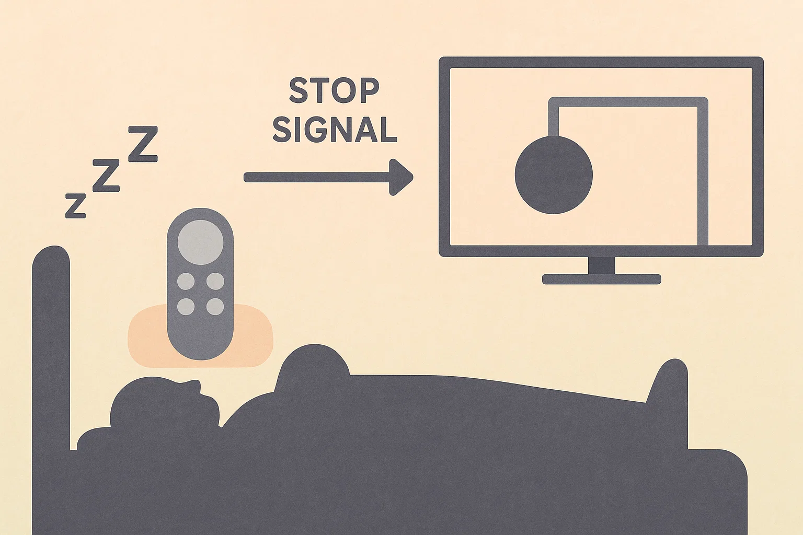

# ねむキャス (Nemucast) 🔊😴

Chromecast / Google TV の音量を定期的に自動で下げるPythonツールです。「ねむキャス」は、寝落ちするときに音量を徐々に下げて、最終的に自動でスタンバイモードに移行させるためのツールです。



## 🎯 機能

- **自動音量調整**: 指定した間隔で Chromecast の音量を段階的に下げます
- **最小音量での自動スタンバイ**: 設定した最小音量に達すると、デバイスを自動的にスタンバイモードにします
- **音量の自動復元**: プログラム起動時の音量を記憶し、終了時に元の音量に戻します
- **柔軟な設定**: 環境変数により、音量の下げ幅、間隔、最小レベルなどをカスタマイズ可能
- **ログ出力**: 動作状況をファイルとコンソールの両方に記録

## 📋 必要な環境

- Python 3.9 以上（推奨: 3.13+）
- 同一ネットワーク上に Chromecast / Google TV デバイス
- macOS / Linux / Windows
- uv（Python環境管理ツール）

## 🚀 インストール手順

### 1. uv のインストール

```bash
# macOS/Linux
curl -LsSf https://astral.sh/uv/install.sh | sh

# または pipx を使用
pipx install uv

# Windows (PowerShell)
powershell -c "irm https://astral.sh/uv/install.ps1 | iex"
```

### 2. リポジトリのクローン

```bash
git clone https://github.com/noricha-vr/nemucast.git
cd nemucast
```

### 3. 依存関係のインストール

```bash
# uvを使用して依存関係をインストール
uv sync
```

## ⚙️ 設定

### 1. 環境変数ファイルの作成

`.env.example` をコピーして `.env` ファイルを作成します：

```bash
cp .env.example .env
```

### 2. 環境変数の設定

`.env` ファイルを編集して、以下の値を設定します：

| 環境変数 | 説明 | デフォルト値 | 例 | コマンドラインオプション |
|---------|------|------------|-----|----------|
| `CHROMECAST_NAME` | 制御対象のChromecastデバイス名<br>ネットワーク上で表示される名前を指定 | `"Dell"` | `"リビングのテレビ"` | `--name`, `-n` |
| `STEP` | 音量を下げるステップ幅（負の値）<br>-0.04 = 4%ずつ下げる | `-0.04` | `-0.05` | `--step`, `-s` |
| `MIN_LEVEL` | 最小音量レベル（0.0～1.0）<br>この値に達するとスタンバイモードに移行 | `0.3` | `0.2` | `--min-level`, `-m` |
| `INTERVAL_SEC` | 音量調整の間隔（秒）<br>1200秒 = 20分 | `1200` | `600` | `--interval`, `-i` |

### 3. Chromecast デバイス名の確認方法

スクリプトを一度実行すると、ネットワーク上のすべての Chromecast デバイスが表示されます：

```bash
uv run python main.py
```

ログに表示されるデバイス名から、制御したいデバイスの名前を確認し、`.env` ファイルの `CHROMECAST_NAME` に設定してください。

## 📖 使用方法

### 基本的な実行

```bash
# デフォルト設定で実行
nemucast

# インターバルを指定して実行（10分間隔）
nemucast --interval 600

# ショートオプションを使用
nemucast -i 300  # 5分間隔
```

### バックグラウンドで実行（Linux/macOS）

```bash
nohup uv run python main.py &

# インターバルを指定してバックグラウンド実行
nohup uv run python main.py --interval 900 &  # 15分間隔
```

### システムサービスとして実行（systemd）

`chrome-volume-down.service` ファイルを作成：

```ini
[Unit]
Description=Chrome Volume Down Service
After=network.target

[Service]
Type=simple
User=your-username
WorkingDirectory=/path/to/chrome-volume-down
ExecStart=/usr/local/bin/uv run --project /path/to/chrome-volume-down python main.py
Restart=on-failure
RestartSec=30

[Install]
WantedBy=multi-user.target
```

### cron による定期実行

深夜に自動的に音量を下げる場合は、cron を使用して設定できます。

#### 1. crontab の編集

```bash
crontab -e
```

#### 2. 実行スケジュールの設定例

```bash
# 毎晩22時に音量下げを開始
0 22 * * * cd /path/to/chrome-volume-down && /usr/local/bin/uv run python main.py >> /path/to/chrome-volume-down/logs/cron.log 2>&1

# 毎晩23時に音量下げを開始（金・土曜日のみ）、インターバルは10分
0 23 * * 5,6 cd /path/to/chrome-volume-down && /usr/local/bin/uv run python main.py --interval 600 >> /path/to/chrome-volume-down/logs/cron.log 2>&1

# 2時間ごとに実行（深夜帯のみ: 22時、0時、2時、4時）、インターバルは5分
0 22,0,2,4 * * * cd /path/to/chrome-volume-down && /usr/local/bin/uv run python main.py -i 300 >> /path/to/chrome-volume-down/logs/cron.log 2>&1
```

#### 3. cron 設定のポイント

- **パスは絶対パスで指定**: cron 実行時は環境変数が限定的なため、フルパスを使用
- **ログ出力**: `>> logs/cron.log 2>&1` でログを保存し、デバッグに活用
- **環境変数の読み込み**: `.env` ファイルは `python-dotenv` が自動的に読み込みます

#### 4. 実行確認

cron のログを確認して正常に動作しているかチェック：

```bash
# cron 自体のログ（macOS）
log show --predicate 'process == "cron"' --last 1h

# cron 自体のログ（Linux）
sudo grep CRON /var/log/syslog

# スクリプトのログ
tail -f /path/to/chrome-volume-down/logs/cron.log
```

## 🔧 動作の仕組み

1. **デバイス検出**: ネットワーク上の Chromecast デバイスを自動検出
2. **接続**: 指定された名前のデバイスに接続
3. **初期音量記憶**: 起動時の音量レベルを保存
4. **音量監視**: 現在の音量レベルを取得
5. **段階的調整**: 設定された間隔で音量を下げる
6. **最小音量チェック**: 最小レベルに達したら初期音量に戻してスタンバイモードに移行
7. **中断時の復元**: Ctrl+C で中断した場合も初期音量に復元

### 処理フロー

```
開始
 ↓
Chromecastを検索
 ↓
指定デバイスに接続
 ↓
初期音量を記憶
 ↓
┌─→ 現在の音量を取得
│   ↓
│  最小音量に達した？
│   ├─ Yes → 初期音量に復元 → スタンバイモード → 終了
│   └─ No → 音量を1ステップ下げる
│       ↓
└──── 指定時間待機

※ Ctrl+C で中断時も初期音量に復元
```

## 🐛 トラブルシューティング

### Chromecast が見つからない場合

1. **同一ネットワークの確認**: PCとChromecastが同じWi-Fiネットワークに接続されているか確認
2. **ファイアウォール**: ファイアウォールがmDNS（ポート5353）をブロックしていないか確認
3. **デバイス名の確認**: `CHROMECAST_NAME` が正しく設定されているか確認

### 音量が変更されない場合

1. **デバイスの状態**: Chromecastが他のアプリで使用されていないか確認
2. **権限**: ネットワーク上でのデバイス制御が許可されているか確認
3. **ログの確認**: `logs/lower_cast_volume.log` でエラーメッセージを確認

### エラー: "音量レベルを取得できませんでした"

- Chromecastが一時的に応答していない可能性があります
- スクリプトは自動的に再試行します
- 頻繁に発生する場合は、Chromecastを再起動してください

### プロセスの停止方法

- **Ctrl+C**: フォアグラウンドで実行中の場合
- **kill コマンド**: バックグラウンドプロセスの場合
  ```bash
  ps aux | grep main.py
  kill [プロセスID]
  ```

## 📝 ログファイル

ログは `logs/lower_cast_volume.log` に保存されます。以下の情報が記録されます：

- デバイスの検出と接続状況
- 音量の変更履歴
- エラーや警告メッセージ
- スタンバイモードへの移行

## 📝 コマンドラインオプション

### 使用可能なオプション

| オプション | 省略形 | 説明 | デフォルト値 |
|---------|------|------|------------|
| `--interval` | `-i` | 音量調整の間隔（秒） | 環境変数 `INTERVAL_SEC` または 1200 |
| `--name` | `-n` | Chromecastの名前 | 環境変数 `CHROMECAST_NAME` または "Dell" |
| `--step` | `-s` | 音量調整のステップ（負の値） | 環境変数 `STEP` または -0.04 |
| `--min-level` | `-m` | 最小音量レベル | 環境変数 `MIN_LEVEL` または 0.3 |

### 使用例

```bash
# デフォルト設定で実行
uv run python main.py

# 5分間隔で音量を下げる
uv run python main.py --interval 300

# 30分間隔で音量を下げる
uv run python main.py -i 1800

# すべてのオプションを指定して実行
uv run python main.py --name "リビングのテレビ" --interval 600 --step -0.05 --min-level 0.2

# 省略形を使用
uv run python main.py -n "寝室のテレビ" -i 300 -s -0.03 -m 0.25
```

## 🤝 貢献

Issue や Pull Request は歓迎します！

## 📄 ライセンス

このプロジェクトは MIT ライセンスの下で公開されています。
